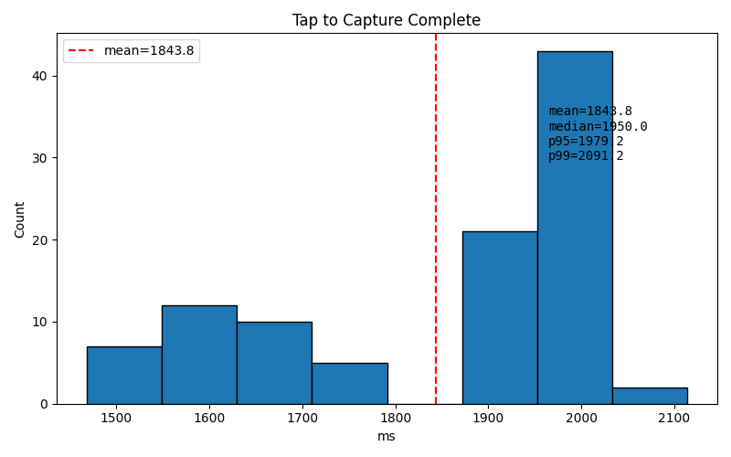
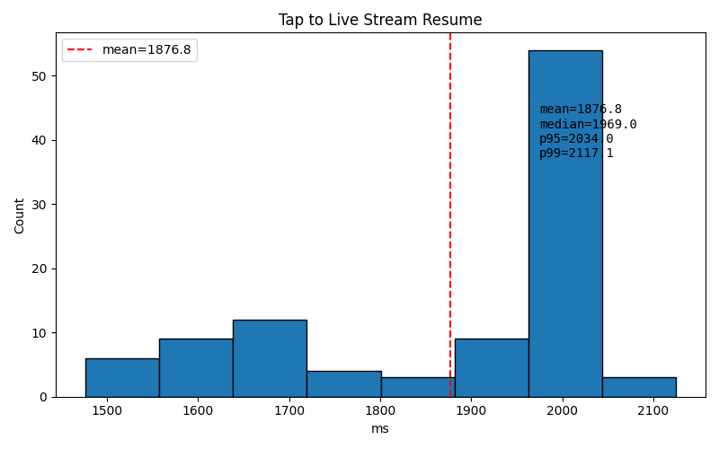
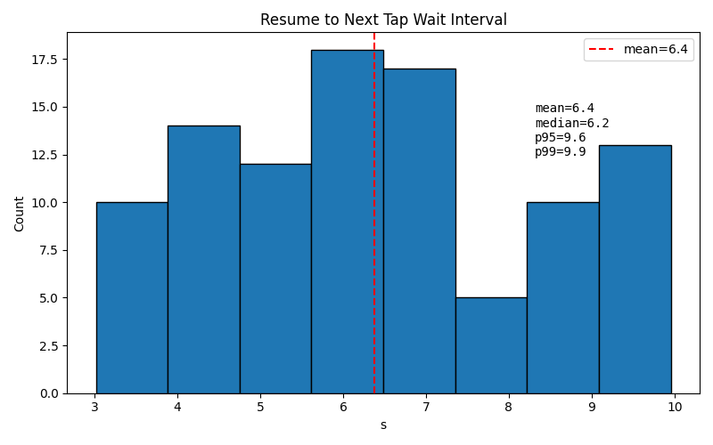

# Still-Capture Lifecycle Improvement Report

## Summary

Eliminated the 12–15 s tail outliers from the still-capture stress test by removing
concurrent CDC-ACM traffic and hardening endpoint-halt recovery. A fresh 100-event
run completed with **100/100 successes**, **no USB host-port recovery**, and a
**p95 tap→complete of 1.98 s** (down from 14.5 s at p99).

## Problem

The previous 100-event report (`still_capture_lifecycle_report.md`) showed a
healthy median (~2 s) but a long tail:

| Metric | Before |
|--------|--------|
| Mean tap→complete | 2387 ms |
| Median tap→complete | 1962 ms |
| p95 tap→complete | 2541 ms |
| p99 tap→complete | 14 495 ms |

The outliers were not the earlier "unplug/replug" USB host stalls (those were
already mitigated by the v5 recovery logic). They were slow-but-successful
captures caused by CDC path instability.

## Root causes isolated from ADB logs

### 1. Concurrent CDC access during capture

`DualCameraActivity` runs a firmware-version query every 5 s through
`CdcCommandHelper` / `usb-serial-for-android`, which opens a **separate**
CDC-ACM connection on the same composite device. Log analysis of the reproduced
outlier (event 38 in `/tmp/simcap_100_v6/full_logcat.log`) showed the version
query opening its CDC port in the same millisecond the still capture sent the
`s\r\n` command. Both OUT bulk transfers failed with `-1`.

```text
06:51:16.510  CdcCommandHelper opens CDC port
06:51:16.518  Still-capture CDC OUT bulkTransfer failed (written=-1)
06:51:16.525  CdcCommandHelper version query also fails writing to CDC
```

### 2. Fragile endpoint-halt recovery

After an OUT stall, the retry logic did a full CDC refresh and sent a brand-new
capture command. Because the first command may already have reached the firmware,
the duplicate command could be queued, causing the retry to time out for 10 s
waiting for `STILL_LEN`. In event 38 this took **two** full refresh/retry cycles
before the third attempt succeeded.

Payload reads also gave up after 60 consecutive `bulkTransfer` failures. Event 19
in the reproduced log stalled after reading 71 680 / 190 419 bytes and then spun
through 60 immediate failures in a few milliseconds.

### 3. AprilTag native crash (discovered during validation)

During the first validation run (v7) the app crashed in `libapriltag_jni.so`:

```text
Abort message: '.../apriltag/common/zarray.h:217: void zarray_get_volatile(...): assertion "idx < za->size" failed'
```

The crash happened on the internal AprilTag worker thread. It killed the app
mid-capture, which forced the test harness to run USB host recovery and looked
like a USB stall in the summary.

## Changes

### Android app: `app/src/main/java/com/example/remotesupportheadset/DualCameraActivity.kt`

1. **Pause firmware-version queries during capture**  
   `firmwareVersionRunnable` now skips its cycle when `isCapturing` is true,
   preventing concurrent CDC-ACM access while a still capture is in flight.

2. **Retry CDC OUT bulkTransfer in place**  
   `doSingleCapture()` retries the OUT `bulkTransfer` up to 3 times, clearing the
   endpoint halt and sleeping 150 ms between attempts, before escalating to a
   full capture retry.

3. **Recover IN endpoint halt during payload reads**  
   `readExactly()` now clears the IN endpoint halt after 5 consecutive failures
   and continues until the payload deadline, with a 10 ms sleep to avoid
   tight-spinning on an immediately-failing endpoint.

### Native: `app/src/main/cpp/apriltag_jni.cpp`

1. **Single-threaded, serialized detection**  
   Set `s_detector->nthreads = 1` and wrapped `apriltag_detector_detect()` with
   a `pthread_mutex_t`. This removes the internal worker-pool race that caused
   the `zarray_get_volatile` assertion, at the cost of ~2× CPU time (still within
   the preview frame budget).

## Validation

### Test setup

- Harness: `scripts/simulate_capture_lifecycle.py --count 100`
- Device: Pixel 10a
- Firmware: `20260817_135949`
- Output: `/tmp/simcap_100_v8/`

### Results

| Metric | Before (v5) | After (v8) |
|--------|-------------|------------|
| Events | 100 | 100 |
| Successes | 100 / 100 | **100 / 100** |
| Stream resumes | 100 / 100 | **100 / 100** |
| Mean tap→complete | 2387 ms | **1844 ms** |
| Median tap→complete | 1962 ms | **1950 ms** |
| p95 tap→complete | 2541 ms | **1979 ms** |
| p99 tap→complete | 14 495 ms | **2091 ms** |
| USB host recovery events | 0 | **0** |
| Capture-attempt failures | — | **0** |
| Incomplete JPEG events | — | **0** |
| `STILL_LEN` timeouts | — | **0** |

Four transient CDC OUT stalls still occurred, but the in-place retry handled all
of them without a capture retry, timeout, or host-port reset:

```text
CDC OUT bulkTransfer failed (attempt 1/3): written=-1 ...
CDC OUT bulkTransfer failed (attempt 2/3): written=-1 ...
CDC OUT bulkTransfer failed (attempt 1/3): written=-1 ...
CDC OUT bulkTransfer failed (attempt 1/3): written=-1 ...
```

### Histograms

#### Tap to Capture Complete — v8



#### Tap to Live Stream Resume — v8



#### Resume to Next Tap Wait Interval — v8



### Raw data

- CSV: [`events_v8.csv`](events_v8.csv)

## Conclusion

The 12–15 s capture tail is gone. Remaining CDC stalls are rare, transient, and
now self-heal inside `doSingleCapture()` without user-visible retry loops or USB
recovery. The AprilTag crash path that could masquerade as a USB stall is also
closed.
