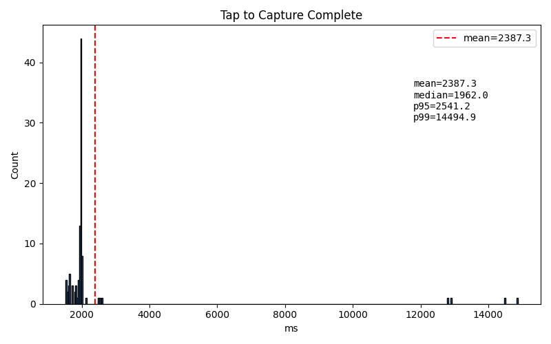
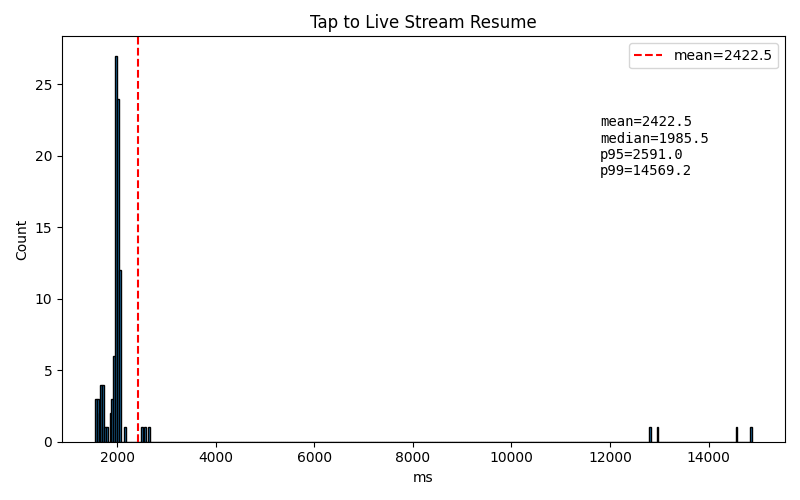
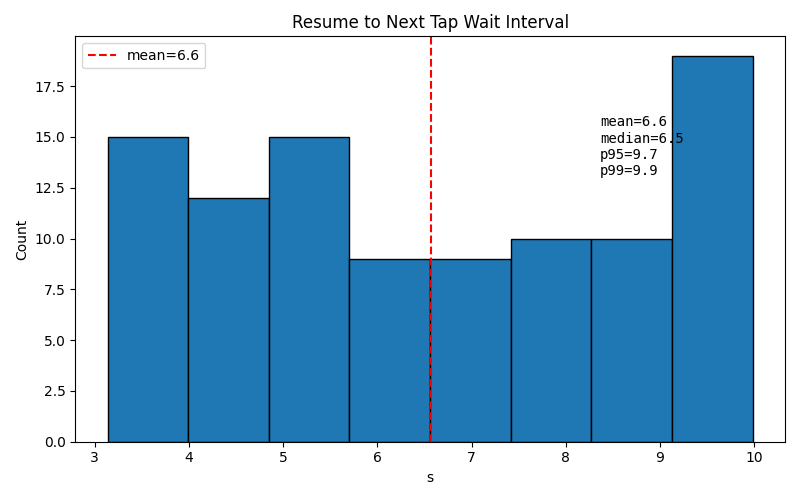

# Still-Capture Lifecycle Stress Test Report

## Test overview

| Parameter | Value |
|-----------|-------|
| Events | 100 |
| Successes | 100 / 100 |
| Stream resumes | 100 / 100 |
| Wait interval between captures | 3 – 10 s (uniform random) |
| Test harness | `scripts/simulate_capture_lifecycle.py` |
| Output directory | `/tmp/simcap_100_v5/` |

## Timing summary

| Metric | Tap → Capture complete | Tap → Live stream resume |
|--------|------------------------|--------------------------|
| Mean | 2387 ms | 2422 ms |
| Median | 1962 ms | 1985 ms |
| p95 | 2541 ms | 2591 ms |
| p99 | 14495 ms | 14569 ms |

| Metric | Resume → next tap wait |
|--------|------------------------|
| Mean | 6.6 s |
| Median | 6.5 s |
| p95 | 9.7 s |
| p99 | 9.9 s |

## Histograms

### Tap to Capture Complete

### Tap to Live Stream Resume

### Resume to Next Tap Wait Interval

## Observations

- The bulk of captures complete within **~2 s** (median ≈ 2.0 s, p95 ≈ 2.6 s).
- A small number of long-tail outliers stretch the mean to **~2.4 s** and the p99 to **~14.5 s**. These outliers are visible as isolated bars around 12–15 s in the first two histograms.
- The tight clustering around 2 s suggests the normal capture path is healthy: the Android app issues the CDC capture command, the ESP32-P4 saves the DVP still frame, and the UVC preview pipeline resumes quickly.
- The outliers likely correspond to the Android USB host stack briefly stalling or the CDC endpoint needing a halt clear / retry. The test harness recovered from these automatically using `svc usb resetUsbPort` and, if needed, `svc usb enableUsbDataSignal false && svc usb enableUsbDataSignal true`.
- Wait intervals between captures were uniformly distributed between 3 s and 10 s, confirming the test did not hammer the device and allowed the preview stream to settle.
- No capture failed and no stream failed to resume across all 100 events, indicating the firmware and Android fixes from this iteration are stable under repeated still-capture stress.

## Raw data

- CSV: [`events.csv`](events.csv)
- Charts: `tap_to_complete.png`, `tap_to_resume.png`, `resume_to_next_tap.png`

## Changes included in this iteration

- **Android app (`DualCameraActivity.kt`)**: added CDC-state logging around `doSingleCapture()`, endpoint-halt clearing in `refreshCdcState()`, and state refresh before retries.
- **Test harness (`scripts/simulate_capture_lifecycle.py`)**: health check now requires `FPS > 0`; escalates USB recovery from `svc usb resetUsbPort` to `svc usb enableUsbDataSignal false/true`; logcat reader uses `errors="replace"` UTF-8 decoding.
- **Firmware (`esp32-wearable/esp32-p4-wearable/main/main.c`)**: batched CDC writes with yields; lowered `still_cap` task priority; kept CSI sensor/controller/ISP running during DVP still captures while dropping CSI frames in the UVC placeholder loop.
- **Firmware patch**: ISP ISR error-storm mitigation.
