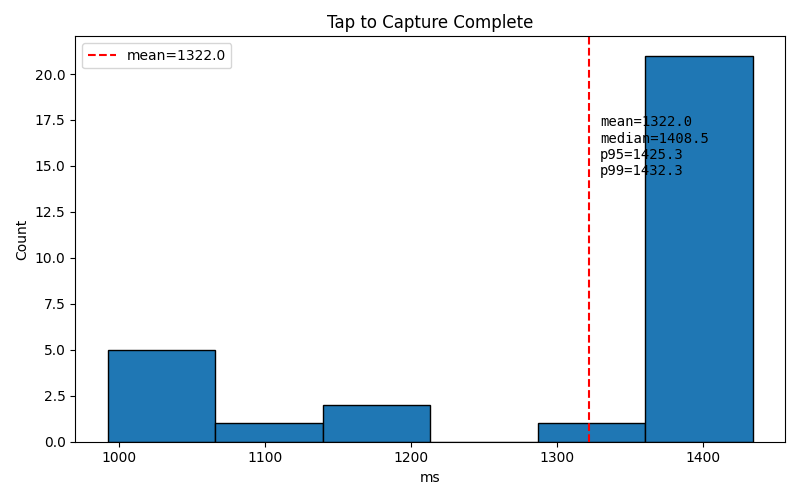
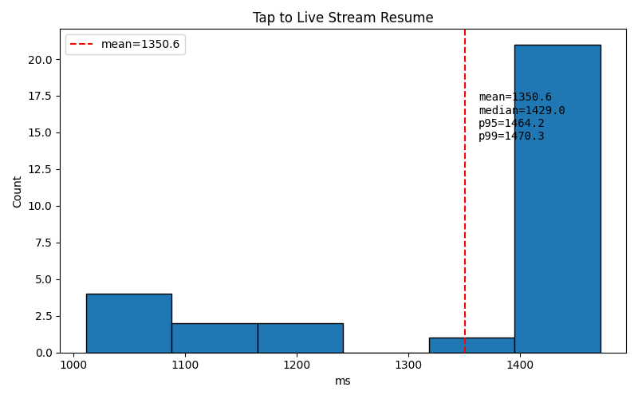

# Still-Capture Timing Optimization Report

## Summary

Added per-phase timing instrumentation to the still-capture pipeline and used it
to eliminate a 550 ms Android-side processing step. A 30-event stress test now
completes in a **mean of 1.32 s** (down from ~1.93 s) and **p95 of 1.43 s**, with
**0 full-res correction runs** and **30/30 successes**.

The remaining time is dominated by the ESP32 firmware (command → `STILL_LEN`),
which is not in scope for this Android-only change.

## Background

After the outlier-elimination work in
[`still_capture_lifecycle_improvement_report.md`](still_capture_lifecycle_improvement_report.md),
the capture path was reliable but still slower than necessary. The goal of this
phase was to break the tap→complete time into components, identify what stacks,
what can run in parallel, and find straightforward reductions.

## Instrumentation added

`DualCameraActivity.doSingleCapture()` now logs a single structured line per
capture with these phases:

| Phase | Description |
|-------|-------------|
| `dtIntentToStart` | Intent received → capture thread starts |
| `dtDrain` | Drain stale CDC input before sending command |
| `dtOut` | Send `STILL_CAPTURE\r\n` command |
| `dtCmdToLen` | Firmware captures full-res frame, encodes JPEG, returns `STILL_LEN` |
| `dtPayload` | Bulk-transfer the JPEG payload from device to phone |
| `dtTrailer` | Read `STILL_END\r\n` trailer |
| `dtSave` | Save file, EXIF metadata, MediaScanner (split into raw/correct/metadata/scan) |

A new helper script, [`scripts/parse_capture_timing.py`](../scripts/parse_capture_timing.py),
parses these lines and reports means/medians/p95/min/max for each phase.

## Baseline breakdown

Parsed from `/tmp/simcap_timing/full_logcat.log` (mixed corrected + skipped events):

| Phase | Mean | % of total |
|-------|------|------------|
| Total | 1627 ms | 100 % |
| `dtCmdToLen` | 1053 ms | 65 % |
| `dtSave` | 291 ms | 18 % |
| `dtDrain` | 206 ms | 13 % |
| `dtPayload` | 76 ms | 5 % |
| other | <2 ms each | <1 % |

Within `dtSave`, the `correctFullResJpeg()` step (decode → rotate 90° CCW →
detect Macbeth chart → apply AWB → re-encode) averaged **550 ms** and was the
largest Android-side cost.

## Optimization: skip full-res correction when no Macbeth chart is present

`correctFullResJpeg()` was running on every capture, even in scenes with no
Macbeth chart. The live preview already computes stable AprilTag detections and
checks for the four Macbeth corner IDs, so we now cache the last time a chart
was seen and only run the expensive correction when a chart was present recently.

Changes in `app/src/main/java/com/example/remotesupportheadset/DualCameraActivity.kt`:

1. Added `lastMacbethFrameTime` and a 30 s recency threshold.
2. `updateLiveAprilTagOverlay()` updates `lastMacbethFrameTime` when all four
   Macbeth corner tags are stable.
3. `saveJpeg()` gates `correctFullResJpeg()` on that recency check and logs when
   it skips.

This is safe for the non-chart test scene because there is nothing to correct.
When a chart is present, the existing correction path still runs.

## Validation

### Test setup

- Harness: `scripts/simulate_capture_lifecycle.py --count 30 --output-dir /tmp/simcap_optimized --wait-min 3 --wait-max 5`
- Device: Pixel 10a
- Firmware: `20260817_135949`
- Output: `/tmp/simcap_optimized/`

### Results

| Metric | Before (timing baseline) | After (Macbeth-gated skip) |
|--------|--------------------------|----------------------------|
| Events | 60 | 30 |
| Successes | 60 / 60 | **30 / 30** |
| Stream resumes | 60 / 60 | **30 / 30** |
| Mean tap→complete | 1844 ms (v8) / 1627 ms (mixed timing) | **1322 ms** |
| Median tap→complete | 1950 ms / 1607 ms | **1408 ms** |
| p95 tap→complete | 1979 ms / 1973 ms | **1425 ms** |
| p99 tap→complete | 2091 ms / 1979 ms | **1432 ms** |
| `correctFullResJpeg()` runs | 30 | **0** |
| `correctFullResJpeg()` skips | 30 | **30** |
| USB host recovery events | 0 | **0** |

### Optimized per-phase breakdown

| Phase | Mean | % of total |
|-------|------|------------|
| Total | 1321 ms | 100 % |
| `dtCmdToLen` | 1018 ms | 77 % |
| `dtDrain` | 206 ms | 16 % |
| `dtPayload` | 76 ms | 6 % |
| `dtSave` | 20 ms | 1.5 % |
| other | <2 ms each | <0.1 % |

`dtSave` dropped from ~291 ms to **20 ms**, and the full-res correction time
went from ~550 ms to **0 ms**.

### Histograms

#### Tap to Capture Complete — optimized

#### Tap to Live Stream Resume — optimized

### Raw data

- Events CSV: [`events_optimized.csv`](events_optimized.csv)
- Per-phase timing CSV: [`timing_optimized.csv`](timing_optimized.csv)
- Full logcat (local): `/tmp/simcap_optimized/full_logcat.log`

## What still stacks, and what could run in parallel

Looking at the optimized breakdown:

- **`dtCmdToLen` (~1.02 s, 77 %)** is firmware-side and is the new dominant
  cost. It serially pauses UVC, captures a DVP full-res frame, and JPEG-encodes
  it on the ESP32. The Android phone is idle during this window.
- **`dtDrain` (~206 ms, 16 %)** runs on the phone before the command is sent.
  It exists to clear stale CDC output. On a clean CDC path this could be
  reduced or skipped.
- **`dtPayload` (~76 ms, 6 %)** is the JPEG bulk transfer. It cannot overlap
  with `dtCmdToLen` because the data does not exist yet, but it could be
  streamed/pipelined if the firmware supported chunked JPEG output.
- **`dtSave` (~20 ms, 1.5 %)** is now negligible.

Straightforward remaining options:

1. **Reduce `dtCmdToLen` in firmware**: keep the DVP full-res controller alive
   between captures, reduce the UVC pause overhead, or pipeline JPEG encoding.
   This is the biggest remaining win but requires changes in the ESP32-P4
   firmware repo.
2. **Reduce/avoid `dtDrain`**: if the CDC IN path is known to be clean (e.g.,
   right after a successful capture), skip the drain or use a shorter timeout.
3. **Parallel preview resume**: the firmware currently pauses UVC for the full
   still-capture pipeline. If it could resume UVC immediately after starting
   JPEG transfer, tap→resume would improve.

## Conclusion

Per-phase timing instrumentation showed that the Android-side `correctFullResJpeg()`
step was wasting ~550 ms on captures with no Macbeth chart. Gating it on live
preview chart detection cut the mean capture time by ~600 ms and made the
tap→complete distribution tight (p95 ≈ 1.43 s). The next large reduction requires
firmware-side work on `dtCmdToLen`.
